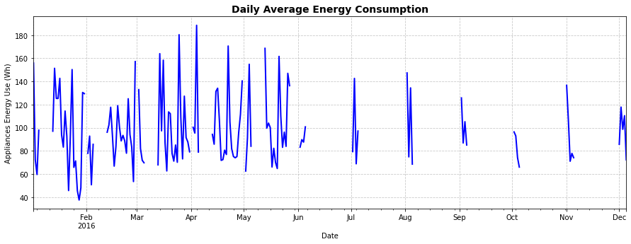
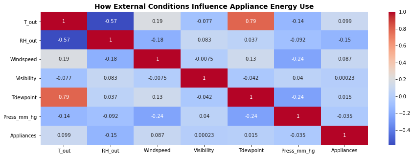

# Energy Consumption Analysis Project

## Project Overview

This project aims to analyze the impact of environmental factors—specifically relative humidity, windspeed, and visibility—on household energy consumption. By comparing high and low energy usage periods, we identify which variables are statistically significant and provide actionable recommendations for predictive modeling.

---

## Research Question

> Which environmental variables are significantly associated with high or low household energy usage?

---

## Methodology - CRISP-DM

### 1. Business Understanding

Energy consumption is influenced by both human activity and environmental conditions. Identifying which external factors are most correlated with energy use can help improve forecasting models and guide the design of smart energy systems.

---

### 2. Data Understanding

The dataset includes:

- Temperatures(`T_1` to `T_9`, `T_out`)
- Relative humidity (`RH_1` to `RH_9`, `RH_out`)
- Windspeed
- Visibility
- Tdewpoint, Pressure

---

### 3. Data Preparation

- Cleaned and selected relevant columns
- Checked for missing values and outliers
- Prepared data for statistical testing and visualization

---

### 4. Modeling

Performed independent sample **t-tests** to evaluate whether there are statistically significant differences in environmental variables between high and low energy usage groups.

---

### 5. Evaluation

#### ✅ Statistically Significant Variables (p < 0.05):
- `RH_1`
- `RH_3`
- `RH_4`
- `RH_out`
- `Windspeed`

These variables show significant differences and may contribute to changes in energy usage.

#### ❌ Not Statistically Significant Variables (p ≥ 0.05):
- `RH_2`, `RH_5`, `RH_6`, `RH_7`, `RH_8`, `RH_9`
- `Visibility`

These variables do not appear to meaningfully impact energy usage in this dataset.

---

#### Recommendations:
- **Feature Selection:** Focus on RH_1, RH_3, RH_4, RH_out, and Windspeed for energy prediction models.
- **Sensor Placement:** Invest in accurate monitoring at key humidity zones and outdoor windspeed sensors.
- **Model Optimization:** Remove less relevant variables to improve model efficiency and interpretability.

---

## Visualizations

> You can embed visualizations here after uploading them to your repo or hosting service.

### Lineplot - Daily Average Energy Consumption 

### LinePlot - Average Hourly Energy Usage 
%20lineplot.png)

### Scatterplot - Appliance Use vs Temperature and Humidity by Room 
!

### Heatmap - How External Conditions Influence Appliance Energy Use

---

## Technologies Used

- Python
- Jupyter Notebook
- Pandas
- Seaborn & Matplotlib
- SciPy (t-test)

---

## Files

| File Name     | Description                                  |
|---------------|----------------------------------------------|
| `index.ipynb` | Contains code, analysis, visualizations, and statistical results |
| `README.md`   | Project overview and documentation            |

---

